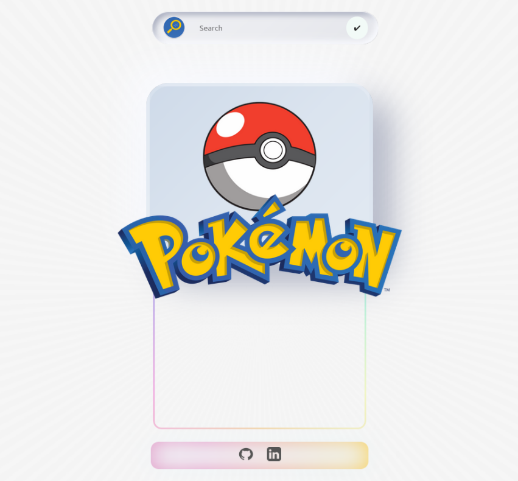

 💫 PokéAPI
============

 

##  Description:

    Small application with Vanilla JS that connects with the Pokeapi API. The application consists of a search engine, which filters pokémon by name.

 
    

</a>

 

## Pokéapi:  

    - https://pokeapi.com/

 

__________
⌨️ with ❤️ by [Davina](https://www.linkedin.com/in/davinamedina/) 😊